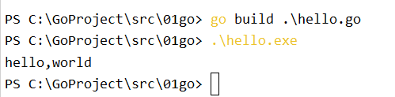
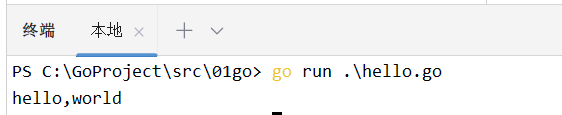
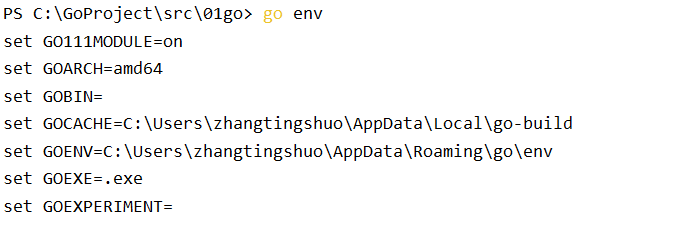

# 01-go常用命令

直接在终端输入 **go help** 即可显示所有的go命令以及相应的命令功能简介，主要有以下这些：
## 1. build：编译包和依赖
```go
build的使用方法：
    编写完一个.go文件后，在终端使用 go build 文件名，可编译出一个可执行文件
    ./可执行文件名  即可执行
```


## 2. run：执行go文件

```go
run的使用方法：
    go run 文件名
    即可执行文件
```


## 3. env：显示当前go的环境变量

```go
go env 即可
```


## 4. get：下载并安装包和依赖

## 5. fmt.Printf
`在 Go 的 fmt.Printf 函数中，% 后的字母用于指定要格式化输出的值的类型。以下是一些常见的格式化输出参数`:
```
%d：将一个有符号整数格式化为十进制表示；
%f：将一个浮点数格式化为标准的小数形式；
%s：将一个字符串格式化为普通字符串；
%q：将一个字符串格式化为带引号的字符串；
%t：将一个布尔值格式化为 true 或 false；
%v：将一个值以默认格式输出；
%T：将一个值的类型以字符串形式输出；
%p：将一个指针格式化为十六进制表示；
%c：将一个整数格式化为对应的 Unicode 字符
```