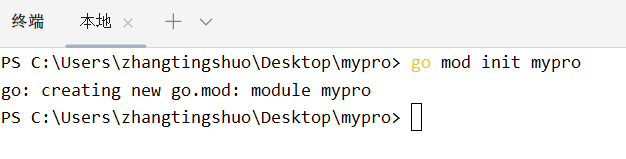
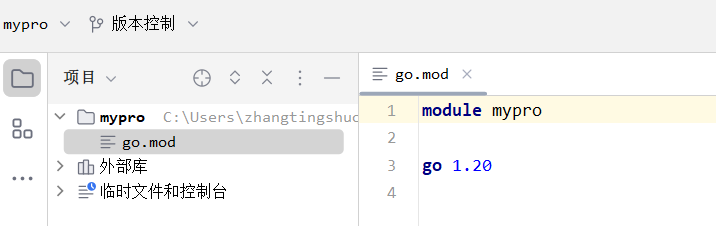
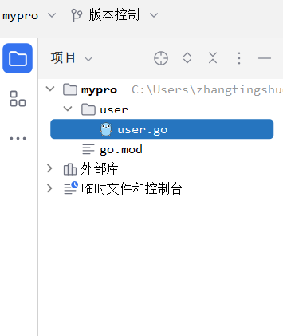
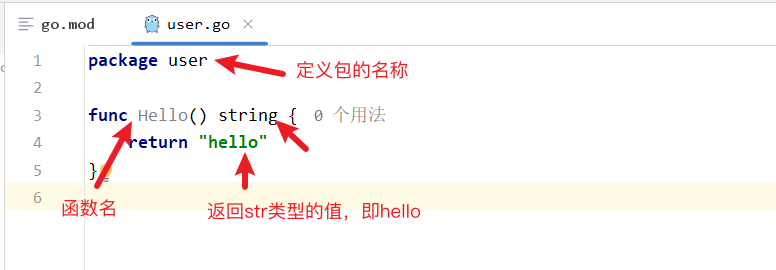
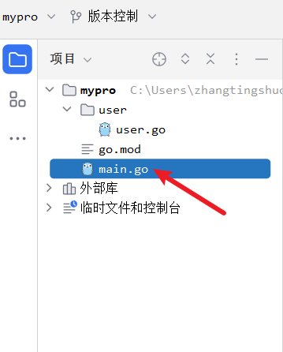
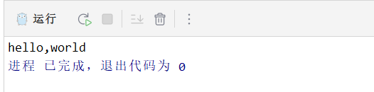

# 02-如何编写go代码

```
go使用包和模块来组织代码，包对应到文件系统就是文件夹，模块就是 .go 的go源文件。一个包中会有多个模块或者多个子包
```

* 创建一个项目的实现步骤：
1. 创建项目
2. 初始化项目
3. 创建包
4. 创建模块
5. 互相调用

## 示例：
1. 创建项目
* 在桌面创建项目文件夹 mypro


* 使用goland（或其他ide）打开文件夹


2.初始化项目
* 初始化该文件夹，打开终端，执行命令

```go
go mod init mypro
```
* 执行后文件夹中会自动生成<mark>go.mod</mark>文件夹



3.创建包
* 创建一个文件夹，文件夹下创建一个go文件，用来声明包


* 在go文件中定义一个名为user的包，这个包定义了一个名为Hello的函数（模块），一般大写开头为公共的


* 继续新建一个main.go的文件（注意层级关系）


4.互相调用


5.执行
