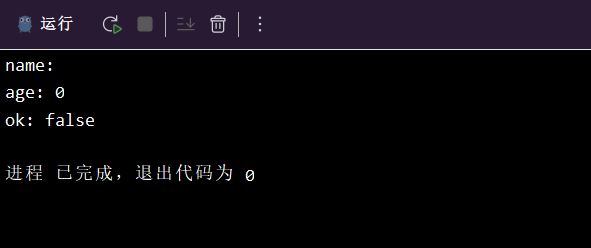

# 04-go变量
> 变量是计算机语言中能储存计算结果或能表示值的抽象概念。不同的变量保存的数据类型可能会不一样

## 一、声明变量
> go语言中的变量需要声明后才能使用，同一作用域内不支持重复声明，并且go语言的变量声明后必须使用

### 1.1声明变量的语法
```
var identifier type
```
var： 声明变量关键字
identifier： 变量名称
type：变量类型

### 1.1示例：
```go
package main

import "fmt"

func main()  {
	var name string  # 名为name的string类型的变量
	var age int
	var ok bool
}
```
### 1.2批量声明：
> 使用一个var()将需要声明的变量填写 

```go
package main

import "fmt"

func main() {
	var (
		name string
		age int
		ok bool
	)
}
```

执行程序查看变量：
```go
package main

import "fmt"

func main() {
	var (
		name string
		age  int
		ok   bool
	)
	// 输出三个变量
	fmt.Printf("name: %v\n", name)
	fmt.Printf("age: %v\n", age)
	fmt.Printf("ok: %v\n", ok)
}
```
都是0值所以输出结果如下：


## 二、变量初始化
> 变量初始化语法

```go
var 变量名 类型 = 表达式
```
示例：
```go
func main() {
	
	var name string = "张三"
	var site string = "www.google.com"
	var age int = 20
```

### 2.1类型推导
> 我们在声明变量时，可以根据初始化值进行类型推导，从而省略类型

```go
func main() {

	var name = "张三"
	var site = "www.example.com"
	var age = 20
```

###  2.2批量初始化
> 可以一次初始化多个变量，中间使用逗号分隔

```go
func main() {

	var name, age, site = "tom", 20, true
```

### 2.3短变量声明
> 短变量声明用在函数内部，:= 运算符对变量进行声明和初始化

```go
// name := "tom"  使用在函数外部会报错
var name = "tom"  正常声明不会

func main() {

	name := "test"
	age := 20
	site := "gmail.com"
```

### 2.4匿名变量

```go

package main

import "fmt"

// 函数的定义名字可以省略，省略可能会可读性变差
func test() (int, int) { //定义一个名为test的函数，函数返回值为int类型
    return 100, 200
}

func main() {
    a, b := test() // 用a，b来接收test中100，200这两个值
    fmt.Println(a, b)
    
    _, b = test() // 如果只想接收b的值，可以用_表示废弃a这个值
    fmt.Println(b)
}
```
### 2.5查看内存地址
```go
package main

import "fmt"

func main() {
    // %d 打印数字 %p 打印内存地址
    num := 100
    fmt.Printf("num: %d,内存地址: %p", num, &num) // 取地址符 &

    num = 200
    fmt.Printf("num: %d, 内存地址: %p", num, &num)
}
```

### 2.6交换变量
```go
package main

import "fmt"

func main() {
    // a 和 b，分别是100、200，现在想将a和b的值互相交换
    a := 100
    b := 200

    fmt.Printf("为交换前a=%d,b=%d\n", a, b) // \n表示换行
    a, b = b, a
    fmt.Printf("交换后a=%d,b=%d", a, b)
}
```

### 2.7变量的作用域
```go
package main

import "fmt"

// 全局变量
var name = "zhangsan"

func main() {
    // 局部变量
    var age = 18
    var name = "lisi" // 全局和局部名称可以相同，但是打印会优先打印局部变量
    fmt.Println(name, age)
}

func aaa() {
    fmt.Println(name) // 全局变量可以在任意函数中使用
    // fmt.Println(age) 会报错
}
```